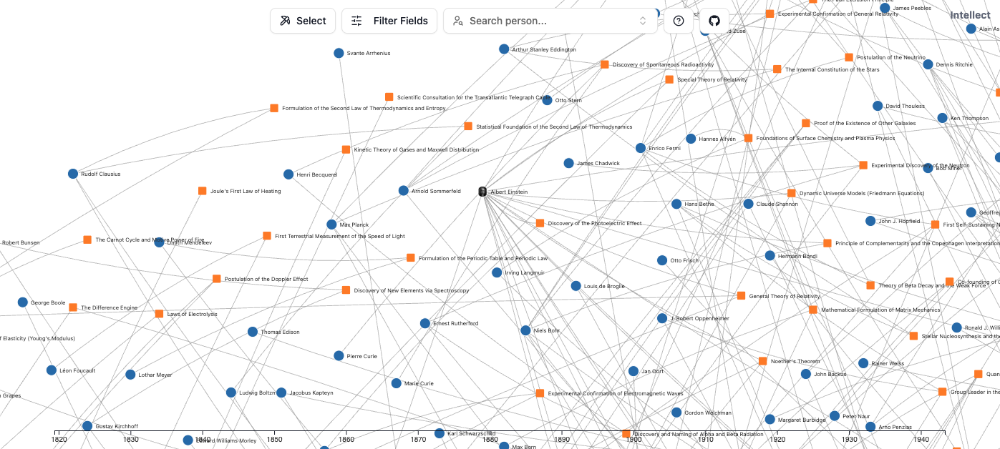

<h1 align='center'>🧭 intellect</h1>

Discover the achievements of intellectuals who changed the course of world history

<a href="https://intellect.fleet.im/">Visit Website</a> · <a href="https://github.com/DipokalLab/intellect/issues">Report Bugs</a>

## About The Project

This project compiles a list of geniuses worldwide, focusing on science and technology, with plans to expand into art and other fields in the future. Developed with D3.js and React.

You can contribute using YAML files in the ./data directory. For details, please refer to the CONTRIBUTING.md file.

> [!IMPORTANT]
> 📢 <strong>This project cannot guarantee the accuracy of the data.</strong> This project is currently focused on science and technology, and the accuracy of connections between entries cannot be guaranteed. Please note that it should not be used as a reference for actual research or precise data.

## Roadmap

- [x] Create Node
- [x] Draw Graph
- [ ] Add Artist
- [ ] AI Chat
- [ ] Add Academic Tools
- [ ] More

## Contributors

Hyeong Jun Huh [(GitHub)](https://github.com/DipokalLab)

## License

MIT License
